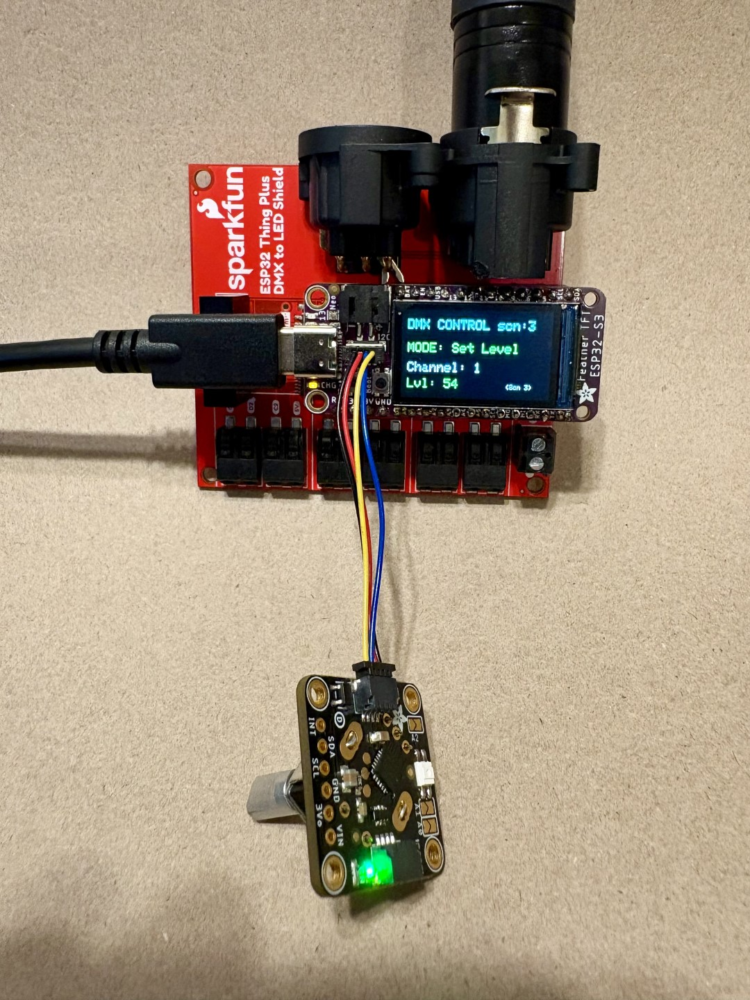

# Adafruit-ESP32-S3-TFT-Feather-DMX-Controller-
Use a Adafruit ESP32-S3 TFT Feather with Sparkfun ESP32 Thing Plus DMX to LED Shield and Adafruit I2C Stemma QT Rotary Encoder Breakout with Encoder to transmit physical DMX

you need three parts:
1. Adafruit ESP32-S3 TFT Feather
2. Sparkfun ESP32 Thing Plus DMX to LED Shield
3. Adafruit I2C Stemma QT Rotary Encoder Breakout with Encoder

Plug these together and upload the code using the Arduino IDE
* In the IDE, set the Board (in Tools menu) to "Adafruit Feather ESP-32 S3 TFT"
* in the Tools, Manage Libraries, install the "Sparkfun DMX Shield Library"

* Put the 4 source code files in a folder names "DMX_Controller" on your dev computer

